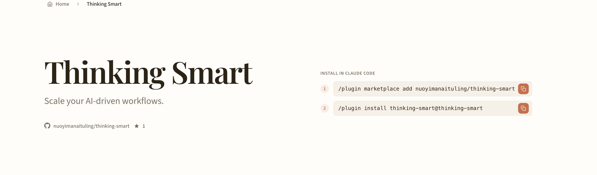
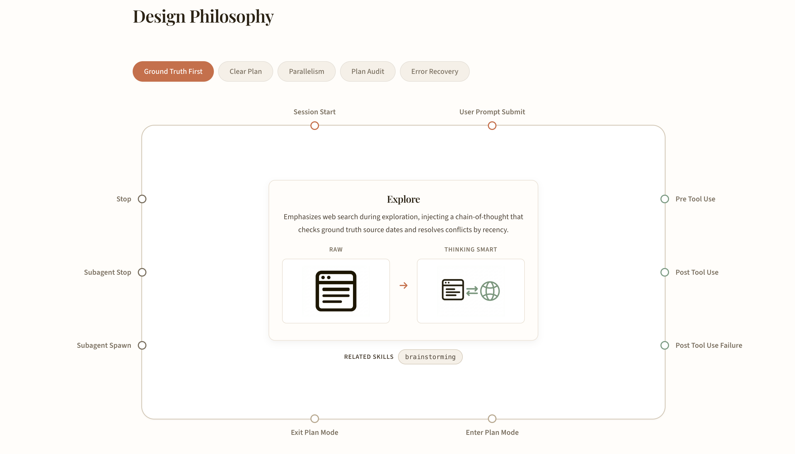

# Thinking Smart

> *Craft with Intention* — Thoughtful skills for AI-driven development

[](https://github.com/nuoyimanaituling/thinking-smart/actions/workflows/deploy-website.yml)

**Thinking Smart** is a Claude Code plugin that scales your AI-driven workflows with structured planning, parallel execution, error recovery, and plan auditing. It transforms how Claude Code approaches complex tasks — from ad-hoc problem solving to intentional, reviewable engineering.

**Website**: [nuoyimanaituling.github.io/thinking-smart](https://nuoyimanaituling.github.io/thinking-smart/)



## Quick Start

Install in Claude Code with two commands:

```bash
# 1. Add the marketplace
/plugin marketplace add nuoyimanaituling/thinking-smart

# 2. Install the plugin
/plugin install thinking-smart@thinking-smart
```

## Skills

| Skill | Command | Description |
|-------|---------|-------------|
| **Brainstorming** | `/thinking-smart:brainstorming` | Explore user intent, requirements, and design before implementation. Emphasizes web search to verify ground truth and resolve conflicts by recency. |
| **Write Plan** | `/thinking-smart:write-plan` | Create structured plan files with diagrams, before/after comparisons, and clear acceptance criteria — not walls of text. |
| **Execute Plan** | `/thinking-smart:execute-plan` | Execute a plan file step by step, spawning parallel subagents for independent tasks to maximize throughput. |
| **Audit Plan** | `/thinking-smart:audit-plan` | Verify planned tasks against actual implementation with evidence-based status: Done, Partial, or Missing. |
| **Recover from Errors** | `/thinking-smart:recover-from-errors` | When tools fail, re-align with the plan file instead of guessing — preventing cascading errors and goal drift. |
| **Using Skills** | `/thinking-smart:using-skills` | Skill discovery and invocation rules for Claude Code conversations. |

## Design Philosophy

The plugin is built around five core principles that enhance Claude Code's capabilities through hooks and structured workflows:



- **Ground Truth First** — Web search during exploration to verify facts against authoritative sources, not just local code.
- **Clear Plan** — Plans use diagrams and structured templates instead of freeform text, making them easy to review at a glance.
- **Parallelism** — Independent tasks are automatically spawned as parallel subagents, maximizing concurrent execution.
- **Plan Audit** — After execution, every task is verified against the plan with evidence-based status reporting.
- **Error Recovery** — On tool failure, the agent consults the plan file and recovers on course, instead of guessing and drifting.

## Repo Layout

```text
.claude-plugin/marketplace.json          # Marketplace registry
claude/thinking-smart/
  .claude-plugin/plugin.json             # Plugin metadata (v1.0.x)
  skills/
    brainstorming/SKILL.md
    write-plan/SKILL.md
    execute-plan/SKILL.md
    audit-plan/SKILL.md
    recover-from-errors/SKILL.md
    using-skills/SKILL.md
  hooks/                                 # Claude Code event hooks
  website.*.toml                         # Website content config
website/                                 # Astro static site
  src/
  public/images/philosophies/            # Generated illustration images
  scripts/                               # Content & image generation scripts
```

## Development

### Setup

```bash
# Clone and configure Git hooks for automatic version bumping
git clone https://github.com/nuoyimanaituling/thinking-smart.git
cd thinking-smart
sh scripts/setup.sh
```

### Add a New Skill

1. Create the skill directory and definition:
   ```bash
   mkdir -p claude/thinking-smart/skills/<skill-name>
   # Create claude/thinking-smart/skills/<skill-name>/SKILL.md
   ```

2. Test locally:
   ```bash
   claude --plugin-dir ./claude/thinking-smart
   ```

Skills are namespaced as `/<plugin-name>:<skill-name>`.

### Website

The `website/` directory contains an Astro static site showcasing the plugin.

```bash
cd website
npm install
npm run dev        # Local dev server
npm run build      # Build to dist/
```

Pushes to `master` automatically deploy via GitHub Actions to GitHub Pages.

## License

Made with intention by [nuoyimanaituling](https://github.com/nuoyimanaituling).
